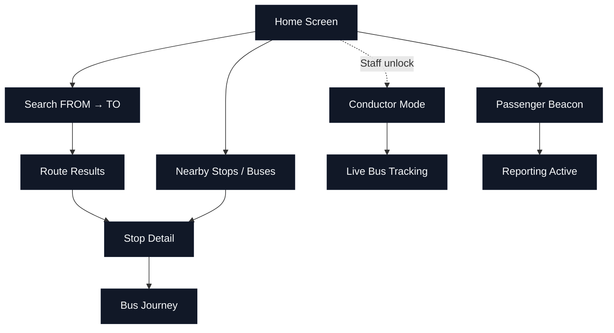

# Vizag Bus Live

## Tech stack

- Flutter (Dart)
- Firebase
  - Firebase Auth (anonymous user sessions)
  - Cloud Firestore (live bus data, sessions, passenger reports)
- Provider for app state management
- Geolocator for location services
- Permission Handler for Android background/location permissions
- Shared Preferences for local conductor/tracking session persistence
- Material UI with custom dark theme

## Architecture

- `lib/main.dart` — app entry point, Firebase init, provider wiring
- `lib/services/` — backend and platform services
  - `app_provider.dart` — central state, live bus stream, location polling, search logic
  - `firestore_service.dart` — Firestore read/write and session management
  - `beacon_service.dart` — passenger reporting beacon
  - `conductor_tracking_service.dart` — conductor live bus tracking mode
  - `location_service.dart` — location permission and distance calculations
- `lib/models/` — live bus, nearby bus, route result models
- `lib/data/vizag_data.dart` — hard-coded stops and routes database
- `lib/screens/` — app UI screens
- `lib/widgets/` — reusable UI components
- `lib/utils/` — theme and constants

## User flow diagram

## Possible user journeys

1. Open app → allow location → view nearby stops and incoming buses.
2. Tap a nearby stop → open stop detail → tap a bus → view stop-by-stop journey timeline.
3. Search a route using FROM and TO stops → view route results → open a stop detail for the selected route.
4. Open Beacon screen → select route → start passenger reporting.
5. Tap the hidden version label 5 times → enter staff code → open conductor mode for live bus tracking.

## File location

- `docs/user-flows.md`
